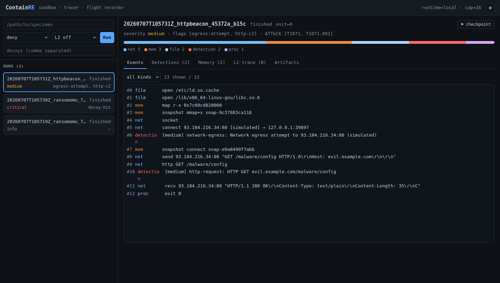

# ContainRE

<p align="center">
  <strong>Sandbox, trace, and replay suspicious Linux binaries without giving them real egress by default.</strong>
</p>

<p align="center">
  <a href="https://www.python.org/"></a>
  <a href="https://www.kernel.org/"></a>
  <a href="https://www.docker.com/"></a>
  <a href="https://fastapi.tiangolo.com/"></a>
  <a href="https://svelte.dev/"></a>
  <a href="https://virustotal.github.io/yara/"></a>
  <a href="https://github.com/rdk/ContainRE/blob/main/LICENSE"></a>
</p>



ContainRE is a controlled analysis harness for potentially dangerous Linux ELF
x86-64 binaries. It runs a specimen, records structured behavior, captures
artifacts, and lets you inspect the result from the CLI, API, or web dashboard.

It is built for authorized reverse engineering and malware analysis on machines
you control.

## Highlights

- **Containment first:** deny real network egress by default; use a locked-down
  [Docker](https://www.docker.com/) runtime for untrusted specimens.
- **Layered tracing:** collect L1 syscall, network, file, process, memory, and
  signal events with [python-ptrace](https://github.com/vstinner/python-ptrace)
  and Linux [ptrace](https://man7.org/linux/man-pages/man2/ptrace.2.html).
- **Instruction-level analysis:** opt into L2 traces with
  [Capstone](https://www.capstone-engine.org/) disassembly and
  [Unicorn](https://www.unicorn-engine.org/) region emulation.
- **Static call-site evidence:** extract ELF symbols, imports, strings, and
  confirmed direct call edges with searchable caller/callee views.
- **Simulated internet:** redirect traffic to a built-in sink so specimens reveal
  HTTP(S) behavior without reaching the public internet.
- **Memory and artifacts:** capture memory snapshots, dropped files, modified
  files, decoy hits, reconstructed pcap data, and best-effort
  [CRIU](https://criu.org/) checkpoints.
- **Detections:** run [YARA](https://virustotal.github.io/yara/) over snapshots
  and artifacts, plus behavioral heuristics for egress, decoys, anti-debugging,
  credential access, and executable-memory behavior.
- **One run format:** store every run as `meta.json`, `policy.yaml`,
  `events.jsonl`, [SQLite](https://sqlite.org/) indexes, snapshots, artifacts,
  pcap, and detections.
- **Evidence reports:** turn completed runs into Markdown/JSON reports with
  reusable assertions for no-egress, no-output, exit-code, artifact, and
  detection expectations.

## Quick Start

Install dependencies with [uv](https://docs.astral.sh/uv/), then build the
included example specimens:

```bash
uv sync
make -C specimens

# Fast local run for trusted examples.
uv run containre run specimens/bin/httpbeacon --net simulate

uv run containre ls
uv run containre show <run_id> --events --kind net
uv run containre summarize <run_id> --write-report
```

Launch the dashboard:

```bash
uv run containre serve
```

Open `http://127.0.0.1:8787`.

## Common Workflows

| Goal | Command |
|---|---|
| Block and record an outbound connection | `uv run containre run specimens/bin/netbeacon --net deny` |
| Simulate HTTP C2 response | `uv run containre run specimens/bin/httpbeacon --net simulate` |
| Detect decoy file tampering | `uv run containre run specimens/bin/filewriter --net deny --decoy wallet.dat` |
| Summarize a completed run | `uv run containre summarize <run_id>` |
| Persist a Markdown/JSON evidence report | `uv run containre summarize <run_id> --write-report` |
| Fail CI on unmet evidence assertions | `uv run containre summarize <run_id> --fail-on-assertions` |
| Extract static call-site evidence | `uv run containre static <run_id>` |
| Find direct callers of a symbol | `uv run containre callers <run_id> connect` |
| Decrypt simulated HTTPS traffic | `uv run containre run specimens/bin/httpsbeacon --net simulate --mitm` |
| Run an offline batch with helper services | policy with `runtime.setup_commands` and optional `runtime.docker_reuse_container` |
| Single-step instructions | `uv run containre run specimens/bin/l2demo --l2 singlestep --l2-max 64` |
| Emulate a code region | `uv run containre run specimens/bin/l2demo --l2 unicorn --l2-region 0x401000:0x401028` |
| Use the safer backend for an untrusted binary | `uv run containre run /path/to/specimen --runtime docker --net deny --timeout 120` |

The default `local` runtime is useful for tests and trusted specimens. Use
`--runtime docker` for untrusted binaries.

## Architecture

```text
CLI / Svelte dashboard
        |
        | REST / WebSocket
        v
FastAPI control plane
        |
        v
Runtime backend: local or Docker
        |
        v
ptrace tracer + optional simulated-internet sink
        |
        v
~/.containre/runs/<run_id>/  events, snapshots, artifacts, pcap, detections
```

Core components:

- [Typer](https://typer.tiangolo.com/) CLI for headless runs and inspection.
- [FastAPI](https://fastapi.tiangolo.com/) plus [Uvicorn](https://www.uvicorn.org/)
  control plane for REST and WebSocket access.
- [Svelte](https://svelte.dev/), [TypeScript](https://www.typescriptlang.org/),
  and [Vite](https://vite.dev/) web UI.
- [JSON Schema](https://json-schema.org/) contracts for policies, events, and
  run metadata.
- [cryptography](https://cryptography.io/) for opt-in TLS interception support.
- [pytest](https://docs.pytest.org/) and [Ruff](https://docs.astral.sh/ruff/) for
  validation and linting.

## Runtimes

| Runtime | Use it for | Isolation |
|---|---|---|
| `local` | tests and trusted samples | host process with [ptrace](https://man7.org/linux/man-pages/man2/ptrace.2.html) interception |
| `docker` | untrusted specimens | [Docker](https://www.docker.com/) container isolation, cgroups, dropped capabilities, no real egress by default |

Both runtimes feed the same tracer and write the same run-directory format.

## Web Dashboard and API

The dashboard can launch runs, stream live events, inspect detections, browse
memory snapshots, review L2 instruction traces, and download artifacts.

Useful endpoints:

| Method | Path | Purpose |
|---|---|---|
| `GET` | `/api/version` | containre, dependency, and system versions |
| `POST` | `/api/runs` | start a run from a binary path or policy |
| `GET` | `/api/runs` | list runs |
| `GET` | `/api/runs/{id}/events?since=` | read events by sequence |
| `GET` | `/api/runs/{id}/summary` | read the post-hoc evidence summary |
| `GET` | `/api/runs/{id}/static` | extract or read static symbol/call-site evidence |
| `GET` | `/api/runs/{id}/static/query?symbol=` | search static callers/callees and graph data |
| `WS` | `/api/runs/{id}/stream` | stream live events and status |
| `GET` | `/api/runs/{id}/snapshots` | list memory snapshots |
| `GET` | `/api/runs/{id}/memory?snapshot=` | inspect snapshot regions and hexdump |
| `GET` | `/api/runs/{id}/detections` | list findings |
| `GET` | `/api/runs/{id}/artifacts` | list captured files |
| `GET` | `/api/runs/{id}/pcap` | download reconstructed pcap |

## Version & environment

`containre --version` prints the containre version, the versions of its direct
dependencies, and relevant system software (Python, OpenSSL, Docker, CRIU, …) in
a stable, machine-parsable format. The same data is served as JSON from
`GET /api/version`, shown on the web dashboard's **About** tab, and available in
Python via `containre.version_info()` / `containre.version_report()`. The format
and parsing contract are documented in
[documentation/version-report.md](documentation/version-report.md).

## Testing

`./run_tests.sh` runs the fast, offline **unit** tests by default; the slower
**integration** group (specimen binaries compiled and run under the ptrace
harness — the `docker` subset also needs a Docker daemon) is off unless asked
for. Any extra arguments are forwarded to pytest.

```bash
./run_tests.sh                     # unit tests only (default)
./run_tests.sh --integration       # unit + integration
./run_tests.sh --only-integration  # integration only (rebuilds specimens first)
./run_tests.sh --all               # both groups (alias for --integration)
./run_tests.sh --integration --no-docker   # skip the Docker-daemon subset
./run_tests.sh -v -k policy        # unit tests, extra args passed through to pytest
./run_tests.sh --help              # full list of group flags
```

Other checks:

```bash
uv run pytest
uv run ruff check containre tests
python3 contracts/validate.py

cd webapp
npm run build
npx svelte-check --tsconfig ./tsconfig.json
```

[Docker](https://www.docker.com/) integration tests skip automatically when a
usable Docker daemon is not available.

## Documentation

- [Documentation index](documentation/README.md)
- [Features](documentation/features.md)
- [Architecture and tech stack](documentation/architecture.md)
- [Reporting and assertions](documentation/reporting.md)
- [Tutorials](documentation/tutorials.md)
- [Batch runs and helper services](documentation/batch-helper-services.md)
- [Contracts](contracts/README.md)

## Safety

ContainRE is for authorized analysis only. The control API is unauthenticated and
powerful, so keep it bound to `127.0.0.1` unless you place your own access control
in front of it. Start with `--net deny`, short timeouts, and the
[Docker](https://www.docker.com/) runtime when handling unknown binaries.
