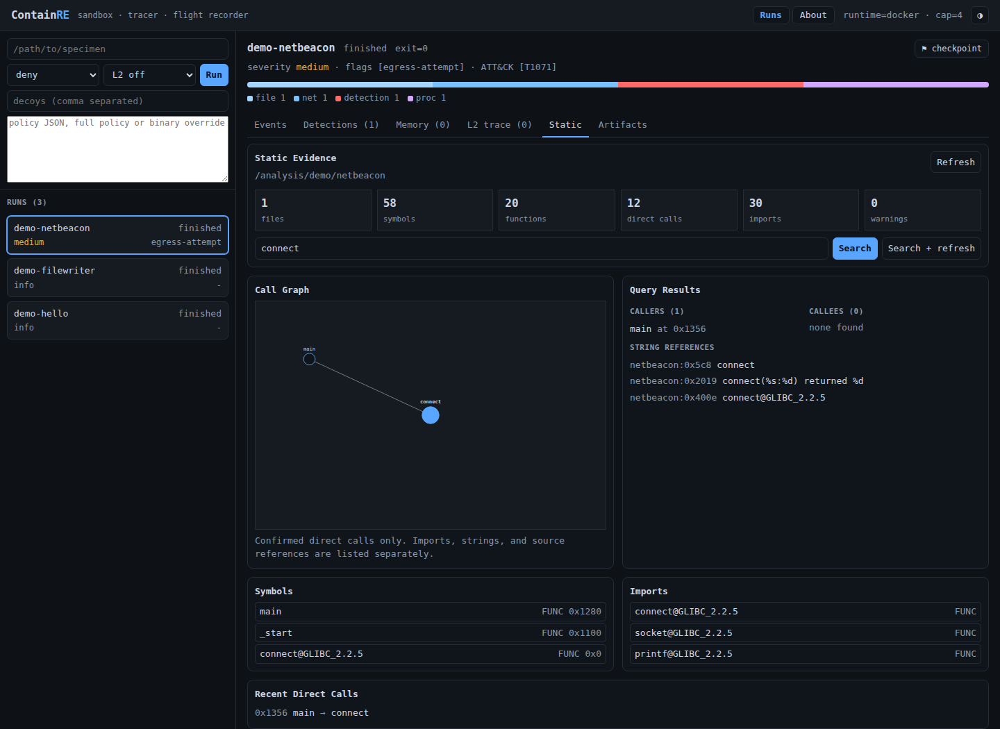

# Tutorials

These tutorials start with local trusted specimens and move toward workflows you
would use for suspicious or untrusted binaries. Build the example specimens once:

```bash
uv sync
make -C specimens
```

## Beginner: Run a Benign Specimen

Goal: create a run and inspect the summary.

```bash
uv run containre run specimens/bin/hello --net deny
uv run containre ls
```

Pick the `run_id` from `containre ls`, then inspect metadata and the first events:

```bash
uv run containre show <run_id> --events --limit 20
uv run containre summarize <run_id>
```

Use this workflow to confirm your local install and run directory are working.
The summary view is the fastest way to spot grouped network endpoints,
detections, and repeated blocked-egress patterns.

## Beginner: Observe a Blocked Network Attempt

Goal: see egress containment in the event stream.

```bash
uv run containre run specimens/bin/netbeacon --net deny
uv run containre show <run_id> --events --kind net
```

Expected result: a `connect` event with a blocked decision. Under `deny`, the
specimen is traced but does not get real egress.

## Intermediate: Let the Simulated Internet Answer

Goal: make a specimen reveal HTTP behavior without real network access.

```bash
uv run containre run specimens/bin/httpbeacon --net simulate
uv run containre show <run_id> --events --kind net
```

Expected result: HTTP-related network events from the built-in sink. This is the
default analysis pattern for specimens that need a response before they expose
their next behavior.

## Intermediate: Detect Decoy File Tampering

Goal: plant a canary file and trigger detection when a specimen touches it.

```bash
uv run containre run specimens/bin/ransomemu --net deny --decoy wallet.dat
uv run containre show <run_id> --events --kind detection
```

Expected result: a decoy-related detection and captured file activity. The
`ransomemu` specimen is a safe emulator: it operates in the harness work
directory and does not encrypt user files.

## Intermediate: Use the Web Dashboard

Goal: watch runs live and inspect memory, detections, artifacts, and pcap output.

```bash
uv run containre serve
```

Open `http://127.0.0.1:8787`. Launch a specimen from the UI or start one from the
CLI while the server is running:

```bash
uv run containre run specimens/bin/filewriter --net deny --decoy wallet.dat
```

Use the dashboard for live event streams and post-hoc review of completed runs.

## Advanced: Capture HTTPS with TLS MITM

Goal: decrypt HTTPS C2-like traffic in the simulated sink.

```bash
uv run containre run specimens/bin/httpsbeacon --net simulate --mitm
uv run containre show <run_id> --events --kind net
```

Expected result: HTTPS events that include decoded request information. TLS MITM
is detectable by real malware and is intentionally opt-in.

## Advanced: Capture OpenSSL Plaintext In A Live Client

Goal: inspect authorized TLS traffic to a real allowlisted service by hooking
OpenSSL `SSL_read` and `SSL_write` inside the specimen process.

Use [TLS Plaintext Capture](tls-plaintext-capture.md) for the detailed workflow.
This is different from TLS MITM: the remote service remains real, and the
capture happens before encryption and after decryption in the client process.

## Advanced: Replace A gRPC Service Offline

Goal: rerun a service-dependent specimen without letting it contact any outside
machine.

First capture an authorized, narrowly allowlisted real exchange with OpenSSL
plaintext observation. Then infer an offline sink fragment:

```bash
uv run containre infer-h2-grpc-replay /path/to/tls_plaintext_capture.log
```

For a low-overhead rerun where Docker isolation and the emulator remain enabled
but ptrace/snapshots/detectors are turned off:

```bash
uv run containre infer-h2-grpc-replay /path/to/tls_plaintext_capture.log \
  --service-host service.example.internal \
  --service-port 443 \
  --no-trace \
  --assert-no-egress
```

Use the generated `network.sink.type: h2-grpc-replay` policy fragment with
`network.docker_network: none`, rerun the specimen, and compare outputs against
the real baseline. The report's `network.real_allowed_remote_endpoint_event_count`
metric should be `0`.

Use [Offline Service Emulation](offline-service-emulation.md) for the full
workflow and interpretation checklist.

## Advanced: Run A Large Offline Batch

Goal: run one batch driver inside one isolated Docker namespace, with local
helper services and an offline service emulator.

Use policy `runtime.setup_commands` to start local helper services, run the
batch driver as the specimen, and keep Docker networking disabled. For repeated
low-overhead no-trace batches, add:

```yaml
runtime:
  docker_reuse_container: true
  docker_reuse_key: batch-screen
```

Use [Batch Runs and Helper Services](batch-helper-services.md) for the full
policy shape, limitations, and benchmark guidance.

## Advanced: Trace Instructions with Single-Step L2

Goal: record per-instruction disassembly and register/memory deltas.

```bash
uv run containre run specimens/bin/l2demo --l2 singlestep --l2-max 64
uv run containre show <run_id> --events --kind instr --limit 20
```

Single-step tracing is faithful but slow. Keep windows small and use it after L1
events tell you where to focus.

## Advanced: Emulate a Code Region with Unicorn

Goal: emulate an isolated region seeded from the live process.

```bash
uv run containre run specimens/bin/l2demo --l2 unicorn --l2-region 0x401000:0x401028
uv run containre show <run_id> --events --kind instr --limit 20
```

Use Unicorn mode for function-level algorithm or unpacking analysis. It is useful
for exploration, but it can diverge from full OS behavior.

## Advanced: Inspect Static Call Sites

Goal: answer questions such as "who calls this symbol?" without manually
copying `objdump` output into notes.

Run or choose a completed specimen run, then extract static evidence:

```bash
uv run containre static <run_id>
uv run containre callers <run_id> connect
uv run containre callees <run_id> main
```

The analysis is cached under the run directory as `static/static.json`. The
dashboard also has a **Static** tab: search for a symbol or name fragment to see
matches, callers, callees, strings, and a compact call graph.



Use `--refresh` when the target binary changed or when you want to recompute the
artifact:

```bash
uv run containre static <run_id> --refresh
```

Static call graphs are conservative. Confirmed edges come from direct
disassembled calls. Indirect calls, vtables, plugins, and dynamic dispatch may
need manual review or deeper tooling.

## Advanced: Use Docker for an Untrusted Specimen

Goal: run with the safer backend.

```bash
uv run containre run /path/to/specimen --runtime docker --net deny --timeout 120
```

Use `docker` for real suspicious binaries. Keep the control API bound to localhost
and use restrictive policies first: `--net deny`, short timeouts, and decoys only
inside the work directory.

## Advanced: Run from a Policy File

Goal: make a reproducible run configuration.

Copy [contracts/examples/policy.example.yaml](../contracts/examples/policy.example.yaml)
and edit `specimen.path`, `network`, `files.decoys`, and `trace`.

For installed applications that need a dependency tree, add a Docker-only
read-only mount. If the launcher expects to run from its installed path, also
set `specimen.container_path`:

```yaml
specimen:
  path: /opt/vendor-suite/tool
  container_path: /opt/vendor-suite/tool
files:
  read_only_mounts:
    - { source: /opt/vendor-suite, target: /opt/vendor-suite }
```

Then run:

```bash
uv run containre run path/to/policy.yaml
```

The effective policy is persisted into the run directory as `policy.yaml`, so the
run can be reviewed or reproduced later.

## Advanced: Add Evidence Assertions

Goal: make a completed run machine-checkable.

Add report assertions to a policy:

```yaml
report:
  assertions:
    - id: no-real-egress
      subject: network.allowed_remote_endpoint_event_count
      op: eq
      value: 0
      severity: critical
    - id: no-result-artifacts
      subject: artifacts.names
      op: none_match
      value: ["*.csv", "*.zip", "*.json"]
```

Then summarize and persist the report:

```bash
uv run containre summarize <run_id> --write-report --fail-on-assertions
```

Use this pattern for repeatable no-egress/no-output regression checks around
suspicious or proprietary specimens.

## Testing Workflows

Run unit tests only:

```bash
scripts/test-unit.sh
```

Run the extended local specimen suite:

```bash
scripts/test-specimens-extended.sh
```

Run the full Python suite:

```bash
uv run pytest
```

Docker integration tests auto-skip when Docker is unavailable.
